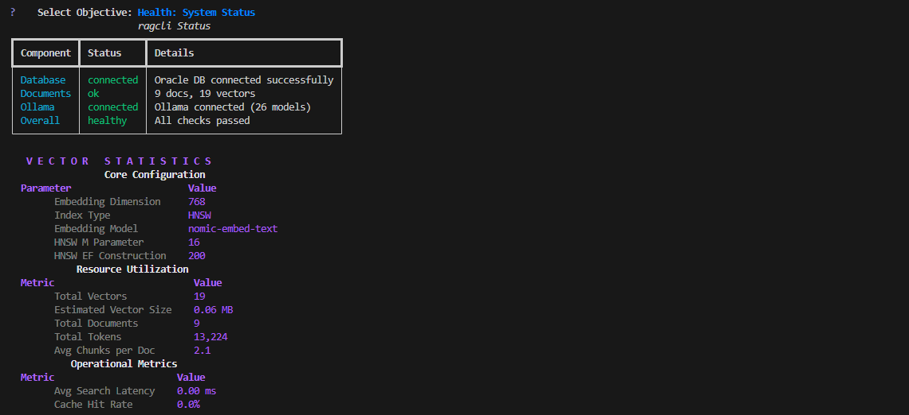
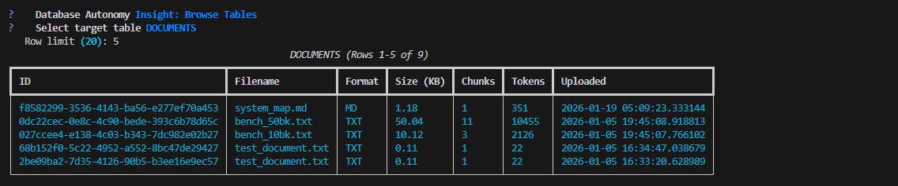

# ragcli

An aesthetic, production-ready RAG system using **Oracle Database 23ai** for vector search and **Ollama** for local LLM inference.


## Architecture

1. **Frontend**: React (Vite) + TailwindCSS
2. **Backend**: FastAPI
3. **Database**: Oracle Database 23ai Free (Vector Store)
4. **LLM**: Ollama (Local Inference)

## Features

- 🚀 **Oracle Database 23ai**: AI Vector Search integration
- 🤖 **Ollama Integration**: Defaulting to the efficient `gemma3:270m` for chat
- 📊 **Real-time Visualization**: Dynamic vector space visualization and heatmap of search calculations
- 📄 **Document Processing**: Support for PDF, Markdown, and Text
- ⚡ **FastAPI Backend**: Robust API with streaming support
- 🎨 **Modern UI**: React + Tailwind + Vite frontend with modern aesthetics and fluid animations
- **AnythingLLM Integration**: Connect with AnythingLLM for an alternative web UI experience
- **Ollama Auto-Detection**: Automatically detect and validate all available Ollama models
- **Core**: Chunking (1000 tokens, 10% overlap), auto vector indexing (HNSW/IVF), metadata tracking, logging/metrics
- **Visualizations**: CLI-based visualizations and Plotly charts for retrieval analysis
- **Deployment**: PyPI, Docker Compose, standalone binary






## Prerequisites
Before running ragcli:
1. **Oracle Database 23ai**: Set up with vector capabilities. Provide username, password, DSN in config.yaml.
2. **Ollama**: Install and run `ollama serve`. Pull models: `ollama pull nomic-embed-text` (embeddings), `ollama pull gemma3:270m` (chat).
3. **Python 3.9+**: With pip.

See [Annex A: Detailed Prerequisites](#annex-a-detailed-prerequisites) for setup links.

## Installation

### From Source (Recommended)
```bash
git clone https://github.com/jasperan/ragcli.git
cd ragcli
pip install -r requirements.txt
```

### Usage
Run the application directly using the root entry point:
```bash
python ragcli.py
```

### Docker Compose (Recommended)
Full stack with ragcli API, AnythingLLM, and Ollama:
```bash
# Create .env file
echo "ORACLE_PASSWORD=your_password" > .env

# Update config.yaml with your Oracle DSN

# Start all services
DOCKER_API_VERSION=1.44 docker-compose up -d

# Pull Ollama models
docker exec ollama ollama pull nomic-embed-text
docker exec ollama ollama pull gemma3:270m

# Access services
# - AnythingLLM UI: http://localhost:3001
# - ragcli API: http://localhost:8000/docs
# - Ollama: http://localhost:11434
```

### Docker (ragcli API only)
```bash
docker build -t ragcli .
docker run -d -p 8000:8000 -v $(pwd)/config.yaml:/app/config.yaml ragcli
```

## Quick Start
1. **Configure**:
   ```bash
   cp config.yaml.example config.yaml
   # Edit config.yaml: Set oracle DSN/username/password (use ${ENV_VAR} for secrets), ollama endpoint.
   # Export env vars if using: export ORACLE_PASSWORD=yourpass
   ```

2. **Initialize Database** (run once):
   ```bash
   python ragcli.py db init  # Creates tables and indexes in Oracle
   ```

3. **Launch CLI (REPL)**:
   ```bash
   python ragcli.py
   ```
   Now features an interactive menu system:
   ```
    ╔════════════════════════════════════════════════════════════════╗
    ║                 RAGCLI INTERFACE                               ║
    ║        Oracle DB 26ai RAG System v1.0.0                        ║
    ╚════════════════════════════════════════════════════════════════╝

   Select a Task:
    [1]  Upload Document     
    [2]  Ask Question        
    [3]  Manage Documents    
    [4]  Visualize Chain     
    [5]  Database Management 
    [6]  System Status       
    [0]  Exit                
   ```
   - Type `help` for classic commands.
   - Example: `upload document.txt`, `ask "What is RAG?"`, `models list`, `db browse`.

4. **Launch API Server**:
   ```bash
   python ragcli.py api --port 8000
   ```
   - API docs: http://localhost:8000/docs
   - Connect with AnythingLLM or use API directly

5. **Launch Premium Frontend (Optional but Recommended)**:
   ```bash
   cd frontend
   npm install
   npm run dev
   ```
   - Access at: http://localhost:5173
   - Featuring: Google-style search bar, drag-and-drop upload, and animated results.

6. **Functional CLI Example**:
   ```bash
   python ragcli.py upload path/to/doc.pdf
   python ragcli.py ask "Summarize the document" --show-chain
   ```

## CLI Usage
- **REPL Mode**: `python ragcli.py` → Interactive shell with arrow-key navigation.
  - Commands: `Ingest`, `Inquiry`, `Knowledge`, `Insight`, etc.
- **Functional Mode**: `python ragcli.py <command> [options]`.
  - `python ragcli.py upload --recursive folder/` - Upload with progress bars
  - `python ragcli.py ask "query" --docs doc1,doc2 --top-k 3`
  - `python ragcli.py models list` - Show all available Ollama models
  - `python ragcli.py status --verbose` - Detailed vector statistics
  - `python ragcli.py db browse --table DOCUMENTS` - Browse database tables
  - `python ragcli.py db query "SELECT * FROM DOCUMENTS"` - Custom SQL queries
  - See `python ragcli.py --help` for full options.

## Premium Web Interface
The project includes a stunning, minimalist frontend inspired by Google AI Studio.

### Features:
- **Google-Style Search**: A clean, elevated search bar with real-time feedback.
- **Fluid Animations**: Powered by `framer-motion` for a premium feel.
- **Drag-and-Drop**: Easy document ingestion with visual previews.
- **Material 3 Design**: Rounded corners, generous whitespace, and Google Sans typography.
- **Visual Vector Search**: Real-time heatmap of query vs result embeddings.

### Usage:
1. Ensure the backend is running: `ragcli api`
2. Start the frontend: `cd frontend && npm run dev`
3. Navigate to `http://localhost:5173`

## API & AnythingLLM Integration
- **FastAPI Backend**: RESTful API with Swagger documentation at `/docs`
- **AnythingLLM**: Modern web UI for document management and chat
- **Docker Compose**: One-command deployment with `docker-compose up -d`
- **API Endpoints**:
  - `POST /api/documents/upload` - Upload documents
  - `GET /api/documents` - List documents
  - `POST /api/query` - RAG query with streaming
  - `GET /api/models` - List Ollama models
  - `GET /api/status` - System health
  - `GET /api/stats` - Database statistics

See [docs/ANYTHINGLLM_INTEGRATION.md](docs/ANYTHINGLLM_INTEGRATION.md) for detailed setup.

## Configuration
Edit `config.yaml`:
```yaml
oracle:
  dsn: "localhost:1521/FREEPDB1"
  username: "rag_user"
  password: "your_password"

ollama:
  endpoint: "http://localhost:11434"
  chat_model: "gemma3:270m"
```
- **api**: Host, port (8000), CORS origins, Swagger docs.
- **documents**: Chunk size (1000), overlap (10%), max size (100MB).
- **rag**: Top-k (5), min similarity (0.5).
- **logging**: Level (INFO), file rotation, detailed metrics.

Safe loading handles env vars (e.g., `${ORACLE_PASSWORD}`) and validation.

## New CLI Features

### Enhanced Progress Tracking
Upload documents with real-time progress bars showing:
- File processing status
-   File processing status
-   Chunking progress
-   Embedding generation with ETA
-   Database insertion progress

```bash
python ragcli.py upload large_document.pdf
# ... progress bar animation ...
# Then displays summary:
# ╭───────────────────────────────────────────────────── Upload Summary ─────────────────────────────────────────────────────╮
# │ Document ID: 68b152f0-5c22-4952-a552-8bc47de29427                                                                        │
# │ Filename: test_document.txt                                                                                              │
# │ Format: TXT                                                                                                              │
# │ Size: 0.11 KB                                                                                                            │
# │ Chunks: 1                                                                                                                │
# │ Total Tokens: 22                                                                                                         │
# │ Upload Time: 826 ms                                                                                                      │
# ╰──────────────────────────────────────────────────────────────────────────────────────────────────────────────────────────╯
```

### Detailed Status & Monitoring
```bash
python ragcli.py status --verbose
# ragcli Status                                                        
# ┏━━━━━━━━━━━━┳━━━━━━━━━━━━━━┳━━━━━━━━━━━━━━━━━━━━━━━━━━━━━━━━━━━━━━━━━━━━━━━━━━━━━━━━━━━━━━━━━━━━━━━━━━━━━━━━━━━━━━━━━━━━━━┓
# ┃ Component  ┃ Status       ┃ Details                                                                                      ┃
# ┡━━━━━━━━━━━━╇━━━━━━━━━━━━━━╇━━━━━━━━━━━━━━━━━━━━━━━━━━━━━━━━━━━━━━━━━━━━━━━━━━━━━━━━━━━━━━━━━━━━━━━━━━━━━━━━━━━━━━━━━━━━━━┩
# │ Database   │ connected    │ Oracle DB connected successfully                                                             │
# │ Documents  │ ok           │ 5 docs, 3 vectors                                                                            │
# │ Ollama     │ connected    │ Ollama connected (24 models)                                                                 │
# │ Overall    │ issues       │ Some issues detected                                                                         │
# └────────────┴──────────────┴──────────────────────────────────────────────────────────────────────────────────────────────┘
#
# ═══ Vector Statistics ═══
# ... (tables for Vector Config, Storage, Performance)
```

### Interactive Database Browser
```bash
python ragcli.py db browse --table DOCUMENTS --limit 20
# DOCUMENTS (Rows 1-5 of 6)                                                  
# ┏━━━━━━━━━━━━━━━━━━━━━━━━━━━━━━━━━━┳━━━━━━━━━━━━━━━━━━━┳━━━━━━━━┳━━━━━━━━━━━┳━━━━━━━━┳━━━━━━━━┳━━━━━━━━━━━━━━━━━━━━━━━━━━━━┓
# ┃ ID                               ┃ Filename          ┃ Format ┃ Size (KB) ┃ Chunks ┃ Tokens ┃ Uploaded                   ┃
# ┡━━━━━━━━━━━━━━━━━━━━━━━━━━━━━━━━━━╇━━━━━━━━━━━━━━━━━━━╇━━━━━━━━╇━━━━━━━━━━━╇━━━━━━━━╇━━━━━━━━╇━━━━━━━━━━━━━━━━━━━━━━━━━━━━┩
# │ 68b152f0-5c22...    │ test_document.txt │ TXT    │ 0.11      │ 1      │ 22     │ 2026-01-05 16:34:47.038679 │
# └──────────────────────────────────┴───────────────────┴────────┴───────────┴────────┴────────┴────────────────────────────┘

ragcli db query "SELECT * FROM DOCUMENTS WHERE file_format='PDF'"
ragcli db stats
```
Browse tables with pagination, execute custom SQL queries, view database statistics.

### Model Management
```bash
ragcli models list
# ┏━━━━━━━━━━━━━━━━━━━━━━━━━┳━━━━━━━━━━━┳━━━━━━━━━━┳━━━━━━━━━━━━━━━━━━━━━┓
# ┃ Model Name              ┃ Type      ┃ Size     ┃ Modified            ┃
# ┡━━━━━━━━━━━━━━━━━━━━━━━━━╇━━━━━━━━━━━╇━━━━━━━━━━╇━━━━━━━━━━━━━━━━━━━━━┩
# │ gemma3:270m             │ Chat/LLM  │ 0.27 GB  │ 2026-01-05T15:00:52 │
# │ nomic-embed-text:latest │ Embedding │ 0.26 GB  │ 2025-11-14T21:38:46 │
# └─────────────────────────┴───────────┴──────────┴─────────────────────┘

ragcli models validate                # Validate configured models
ragcli models check llama3            # Check if specific model exists
```

### Oracle AI Vector Search Integration
ragcli now integrates `langchain-oracledb` for enhanced document processing:
- **OracleTextSplitter**: Database-side chunking.
- **OracleDocLoader**: Load documents using Oracle's loaders.
- **OracleEmbeddings**: Generate embeddings within the database (using loaded ONNX models or external providers).
- **OracleSummary**: Generate summaries using database tools.

#### Testing Oracle Integrations
A dedicated command group `oracle-test` is available to verify these features:
```bash
python ragcli.py oracle-test all                 # Run full test suite
python ragcli.py oracle-test loader /path/to/doc # Test document loader
python ragcli.py oracle-test splitter --text "..." # Test text splitter
python ragcli.py oracle-test summary "..."       # Test summarization
python ragcli.py oracle-test embedding "..."     # Test embedding generation
```
You can also access the **Test Suite** from the interactive REPL menu (Option 7).

## Troubleshooting
- **Ollama unreachable**: Run `ollama serve` and check endpoint. Use `ragcli models list` to verify.
- **Oracle DPY-1005 (Busy Connection)**: Fixed! Ensure you are using the latest version which properly handles connection pooling and closure.
- **Oracle ORA-01745/01484 (Vector Ingestion)**: Fixed! Vector ingestion now uses robust `TO_VECTOR` with JSON-serialized input for maximum compatibility.
- **Looping/Stuck Upload**: Fixed! Corrected infinite loop in `chunk_text` for small documents (<100 tokens).
- **Model not found**: Run `ragcli models validate` for suggestions. Pull with `ollama pull <model>`.
- **API connection**: Check `ragcli api` is running. Test with `curl http://localhost:8000/api/status`.
- **Logs**: Check `./logs/ragcli.log` for details (DEBUG mode for verbose).

For issues, run with `--debug` or set `app.debug: true`.

## Annex A: Detailed Prerequisites
- **Ollama**: https://ollama.com/ - `curl -fsSL https://ollama.com/install.sh | sh`
- **Oracle 23ai**: Enable vector search; connect via oracledb (no wallet needed for TLS).
- **Models**: Ensure pulled in Ollama.

## Annex B: Full Specification
See `.clinerules/ragcli-formal.md` for architecture, schemas, workflows.

## Contributing
See docs/CONTRIBUTING.md (to be added).

## License
MIT
